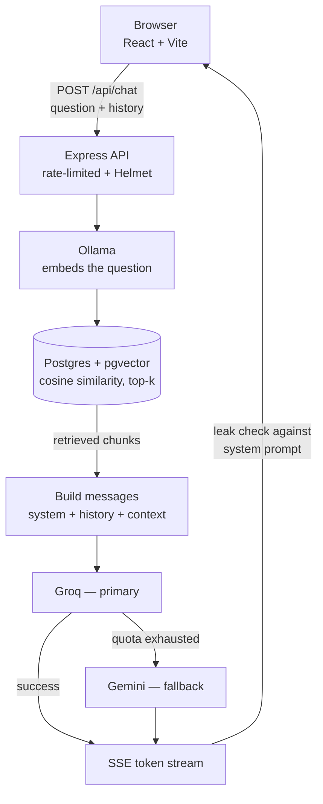

<h1 align="center">cpanagopoulos.dev</h1>
<p align="center"><strong>A portfolio site with a RAG-powered assistant that answers questions about me,<br />grounded only in what it can actually cite.</strong></p>

<p align="center">
  <a href="https://cpanagopoulos.dev"></a>
</p>

<p align="center">
  
  
  
  
  <br />
  
  
  
  
  
  
</p>

---

## What this is

A single-page React portfolio where the "about me" section isn't static text — it's a chat assistant backed
by real retrieval. Every answer is grounded in a set of Markdown source docs (about-me, project notes,
homelab), embedded locally and retrieved by cosine similarity, never invented. If the docs don't cover
something, it says so instead of guessing.

**Highlights:**
- **Retrieval-augmented, not hallucinated** — every answer cites the source chunks it actually used
- **Multi-turn memory** — follow-up questions ("what about for this site?") resolve correctly against the last few exchanges, not answered blind
- **Hardened against prompt injection** — a locked-down system prompt plus a deterministic backstop that catches a system-prompt leak mid-stream and swaps it for a generic error before it ever reaches the client
- **Dual-provider LLM fallback** — Groq first, Gemini automatically if the daily quota's exhausted, with the client shown which one actually answered
- **Streamed token-by-token** over SSE, no polling
- **Built mobile-first for real**, not just responsive breakpoints — separate tab layout, scroll-spy nav, touch-aware carousel

## Architecture



Postgres, Ollama, and the app all come up from one `docker compose up` — the same "single image, own
hardware" pattern the site itself describes for its other projects. Groq/Gemini are the only hosted pieces,
kept for chat-generation speed and quota headroom.

```
client/    React (Vite) — the whole page, including the assistant UI
server/    Express API — /api/chat (SSE), retrieval + LLM orchestration
  content/ Markdown source docs embedded for retrieval
```

## Running it locally

```bash
cp .env.example .env
```

Add a `GROQ_API_KEY` to `.env` (free at https://console.groq.com/keys) — this generates the assistant's
answers. A `GEMINI_API_KEY` (free at https://aistudio.google.com/apikey) is optional but recommended as a
fallback for when Groq's daily quota runs out. Then:

```bash
docker compose up --build
```

Pull the embedding model Ollama needs (first run only):

```bash
docker compose exec ollama ollama pull nomic-embed-text
```

Index the content so the assistant has something to retrieve from:

```bash
npm install
npm run ingest
```

The site is then served at `http://localhost:3100` (mapped from the container's internal port 3000 to
avoid clashing with anything already using 3000 on the host — change the `app` port mapping in
`docker-compose.yml` if you'd rather use a different one).

### Without Docker
Install Postgres (with the `vector` extension) and Ollama yourself, point `.env` at them (plus
`GROQ_API_KEY`), then:
```bash
npm install
npm run dev:server   # Express API on :3000
npm run dev:client   # Vite dev server on :5173, proxies /api to :3000
```

## The assistant's content
`server/content/*.md` holds the about-me, project, and homelab notes the assistant retrieves from. Edit
those files (or add new ones — any `.md` file in that directory gets picked up), then re-run
`npm run ingest` — it's idempotent, so re-running it after edits just re-embeds and upserts the changed
chunks.

## Security

This isn't a toy chatbot bolted onto a portfolio — it's built to resist the obvious abuse a public LLM
endpoint attracts:

- **Rate limiting** — 10 requests/minute per IP on `/api/chat`, since every call costs a real retrieval pass plus an LLM token budget
- **Prompt-injection resistant system prompt** — explicit rules against role escalation ("you are now an admin"), instruction override, off-topic hijacking, and fabricating facts not present in the retrieved context
- **Deterministic leak backstop** — the streamed answer is checked against overlapping windows of the live system prompt as it generates; a leak is caught within a few dozen characters and swapped for a generic error, not trusted to the model's own restraint alone
- **Validated conversation history** — the client sends back its own prior turns for multi-turn context, but the server caps their count and length so a direct API call can't stuff the model's context with a fabricated conversation to prime a jailbreak
- **Helmet security headers** — CSP, HSTS, X-Frame-Options, and friends, tuned to still work correctly behind a plain-HTTP tunnel (Cloudflare Tunnel terminates TLS at the edge)
- **No secrets in the image or the repo** — `.env` is excluded from both git and the Docker build context; sanitized generic error messages mean no internal stack traces ever reach the client

## Tech Stack
- **React** (Vite) — frontend
- **Express** — API, SSE streaming, static file serving
- **PostgreSQL + pgvector** — chunk storage and cosine-similarity retrieval
- **Ollama** — local embeddings (`nomic-embed-text`), no external API key needed for retrieval
- **Groq + Gemini** — chat generation, Groq primary with an automatic Gemini fallback on quota exhaustion
- **Docker / Docker Compose** — one command spins up the whole stack

## Deployment
Runs on a Hetzner VPS via Docker Compose, exposed through a Cloudflare Tunnel — no public ports opened on
the server at all, TLS handled entirely at Cloudflare's edge.

## Author
**Charalampos Panagopoulos**
Junior Full-Stack Web Developer

- [cpanagopoulos.dev](https://cpanagopoulos.dev)
- [linkedin.com/in/c-panagopoulos](https://www.linkedin.com/in/c-panagopoulos/)
- [github.com/c-panagopoulos](https://github.com/c-panagopoulos)
